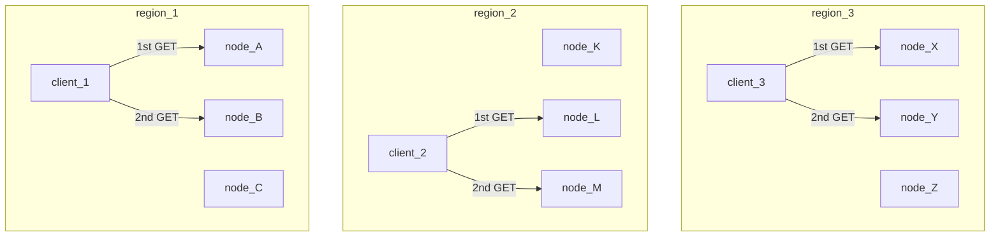
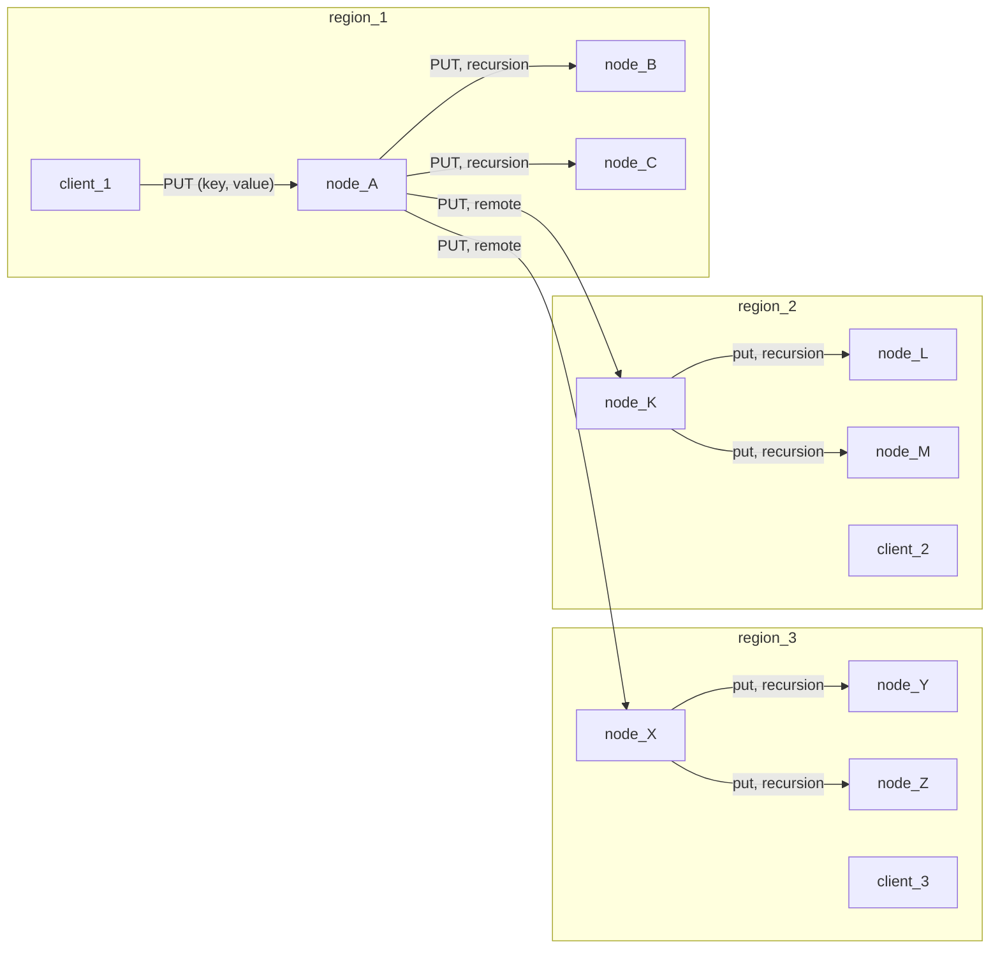
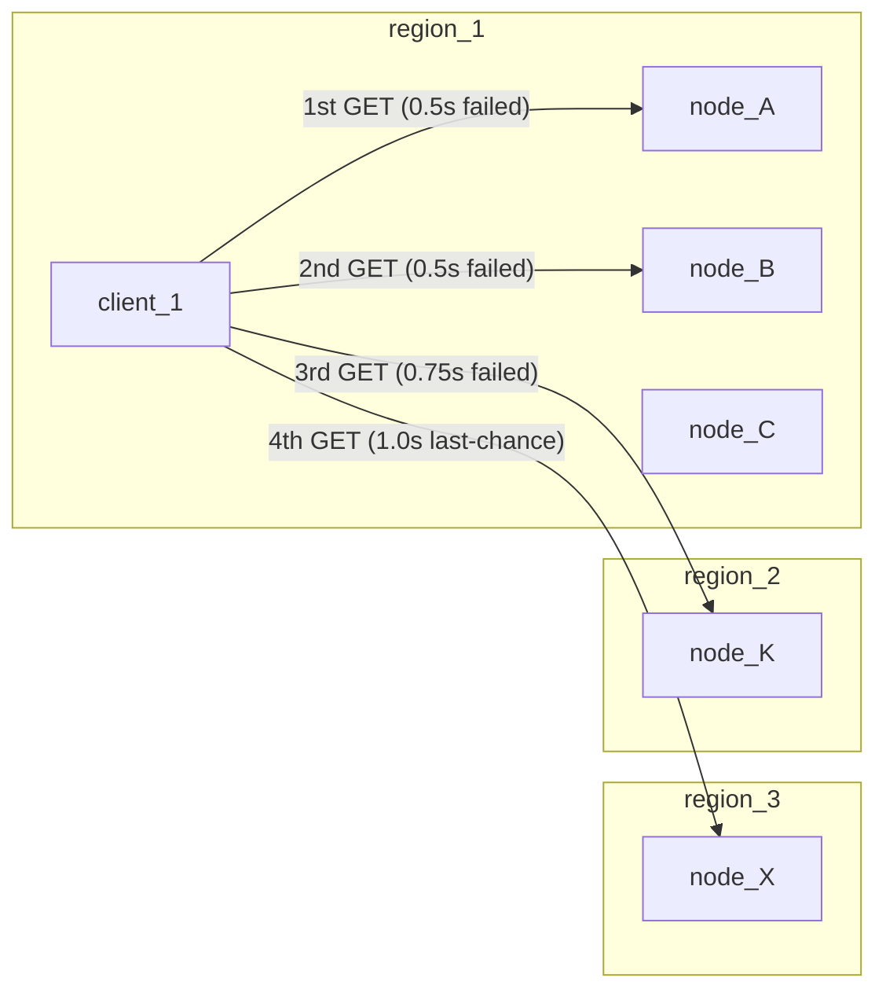

# Zerocache

Zerocache geo-distributed LRU (Least-Recently Used) with time-based expiry, dead-simple integration
options, resiliency to network faults, near real-time replication of data, prioritization of data
fetching from nearest sources, and flexibility of data to be stored.

## Architechure Overview

At its core, Zerocache is a cluster of TLRU cache services over HTTP. An application developer need
only instantiate a client, configuring only its "region", and, it will autonomously handle the
negotiation of network requests.

- Clients and nodes are tagged by "region".
- Each client is aware of all possible nodes (servers).

Clients:

- Clients should be tagged with their local region. However, should it suit one's fancy, they may be
  set up to act as if they are a member of some other region.
- In a given application runtime, instances of clients are intended to be singleton on a per-region
  basis.

Healthy Cluster, Client Operations:

- Clients will make GET requests in round-robin style within their local cluster.



Healthy Cluster, PUT / DELETE:

- A client's PUT will have the receiving node recursively spread the (key, value) data to all local
  nodes.
- The principal node will additionally spread the (key, value) data to one remote node per remote
  region. Those remote nodes will then spread the data to all of their peers within their own
  respective regions.
- Delete operates in much the same way.



Network resiliency - gotta go fast:

- Clients must get full responses back from nodes within fairly short timings.
- There is a simple sequence of fallbacks:
  - Try a local node, within 0.5 seconds
  - Try the next local node, within 0.5 seconds
  - Try a node in another region 1 rank away (average latency), within 0.75 seconds
  - Try a node in another region 2 ranks away (average latency), within 1.0 second



Addition/Removal of Nodes:

- When a new node comes online, it announces itself to the cluster.
- When a node gracefully goes offline, it announces its retirement.

Silently Dead Nodes:

- Detection and management of nodes that silently become unresponsive on a
  long-term / permanent basis is not currently implemented. They will basically
  pollute the cluster and cause "misses" in operations.
- One mitigation strategy that can be considered is to have the dead nodes
  "revive" (re-launched) having the same identity, IP address, and port.
  Such functionality is not currently implemented.

Network requirements:

- It is required that all members of the cluster share a common network subnet.
- This is meant to be achieved with the use of VPNs.

Security:

- The current implementation does not encrypt traffic.
- Feel free to add a proxy/reverse-proxy layer which handles that for you, if so
  desired.

# Getting Started - Python Client

Install zerocache. Using "pip", via PyPi is recommended.

```sh
pip install zerocache
```

Dead-simple decorator style:

- It is assumed that a cluster of servers is already up and running.
- The `auto_zerocache` decorator is a convenience.
- It is recommended to use some kind "config" paramter to define the region.
- The default expiry time is 60 seconds.

```python
import time
import os
from zerocache import auto_zerocache

# The decorator. Needs: region. Default expiry is 60 seconds, here it's 42 seconds.
# Maximum expiry duration is 99999999 seconds (around 3 years).
@auto_zerocache(os.getenv('CACHE_REGION', 'london'), 42)
def delayed_echo(delay, message):
    time.sleep(delay)
    return message

# Recommended: "warmup" time for behind-the-scenes zeroconf setup
time.sleep(3)

t1 = time.perf_counter_ns()
delayed_echo(3, "foo") # on cache miss, delayed_echo() is fully executed
t2 = time.perf_counter_ns()
latency_one = (t2 - t1) // 1000000
print("first invocation latency (ms)", latency_one)

t3 = time.perf_counter_ns()
delayed_echo(3, "foo") # repeated paramaters, cache will almost certainly be used
t4 = time.perf_counter_ns()
latency_two = (t4 - t3) // 1000000
print("second invocation latency (ms)", latency_two)
```

Fine-grained control style:

- It is assumed that a cluster of servers is already up and running.
- This integration style provides access to the `delete` method, useful for
  advanced cache management situations.
- Pickling is highly recommended. Without pickling the returned 'value' is in
  raw form (ex: a string `'foo'` comes back as `b'foo'`, a byte array).

```python
import time
import os
import pickle
from zerocache import ZerocacheClient

# Pre-existing instances may be "wiped" out, as a precaution.
# - useful in situations where multiple modules/files are invoked in the same
#   runtime (ex: pytest)
ZerocacheClient.clear_instance('sydney')

# Create a new instance via the get_instance factory
zc: ZerocacheClient = ZerocacheClient.get_instance("sydney")

# Recommended: "warmup" time for behind-the-scenes zeroconf setup
time.sleep(3)

put_ok            = zc.put('foo', pickle.dumps('bar'), 42) # key, value, expiry time (in seconds)
get_ok, raw_value = zc.get('foo')
value             = pickle.loads(raw_value)
del_ok            = zc.delete('foo')
```

## Getting Started - Python Server

Zerocache provides an implementation of the server side as well.

Briefly, the idea is that compute nodes are created via infrastructure tooling (ex: Kubernetes),
running an instance of `ZerocacheServer`.

A `ZerocacheServer` must be configured with 3 pieces of information "announced address", "port", and
"region".

On startup, a server instance waits until its HTTP service is online, and then announces itself
over zeroconf, effectively joining a cluster.

To gracefully shutdown, send a SIGINT signal. SIGQUIT and SIGTERM may also be viable.

## 🚧 Under construction / Limitations / Known-Issues 🚧

When a server shutdown is "cold turkey" for any reason (pulled the plug, network drops out, etc),
the clients don't really notice nor clean up for the "dead" service. Clients will still keep
trying to communicate to "dead" servers indefinitely, resulting in "HTTP Request Failures/Timeouts"
each time. Of course, they may still have a number of "fallback" servers to try calling upon.

A potential server-side solution would be to "come back to life" using a fixed identity (id, ip
address, port, and region).

Another solution would be to have clients prune "dead" servers after some number of "HTTP Request
Failure/Timeout" faults have been accumulated with a particular server.

